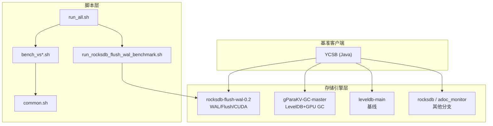
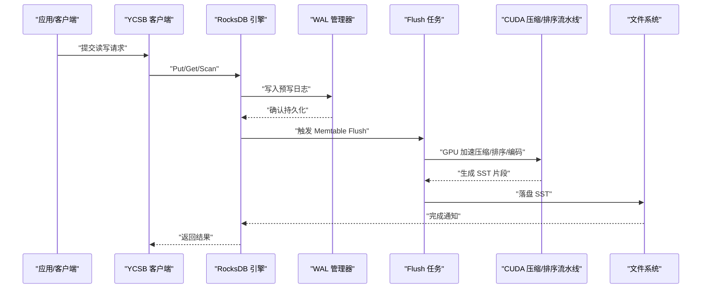
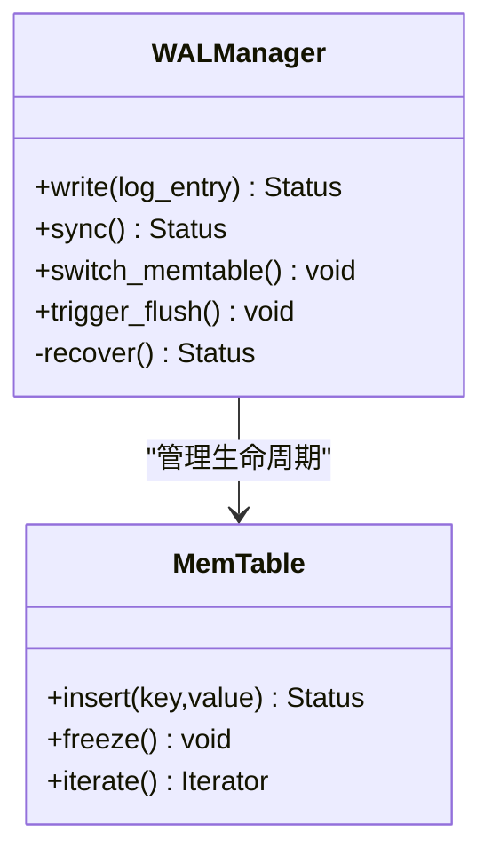
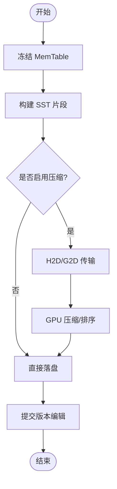
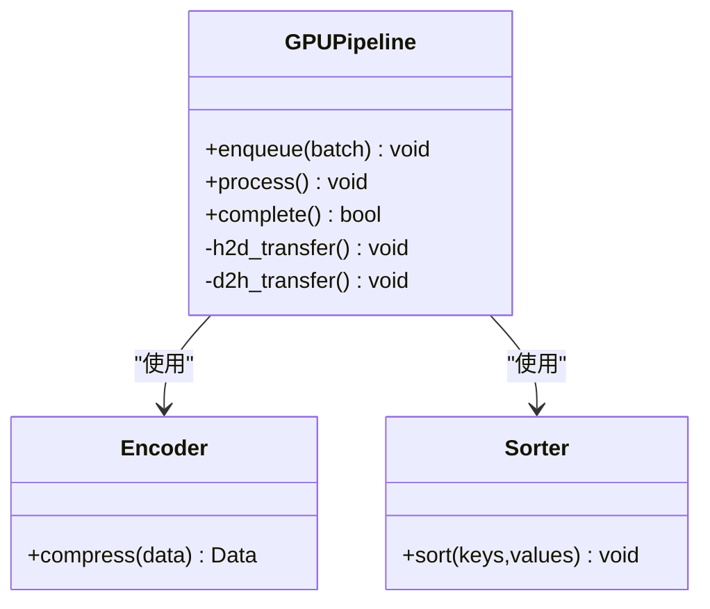
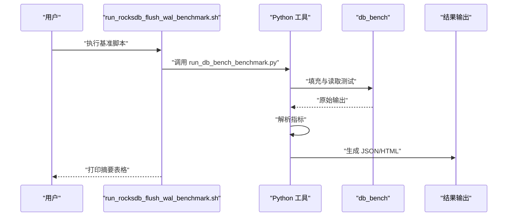
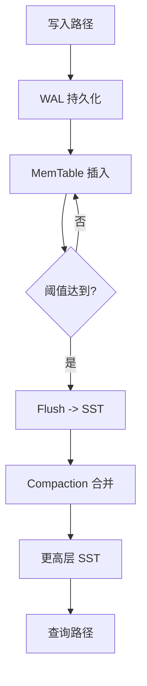
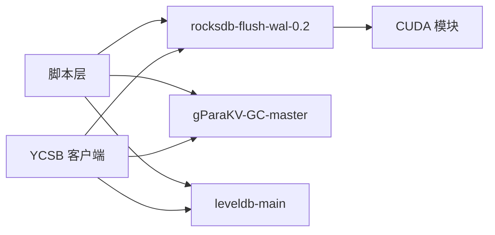

# 项目概述

<cite>
**本文引用的文件**   
- [source/rocksdb-flush-wal-0.2/README.md](file://source/rocksdb-flush-wal-0.2/README.md)
- [script/run_rocksdb_flush_wal_benchmark.sh](file://script/run_rocksdb_flush_wal_benchmark.sh)
- [script/common.sh](file://script/common.sh)
- [script/run_all.sh](file://script/run_all.sh)
- [source/YCSB/README.md](file://source/YCSB/README.md)
- [source/gParaKV-GC-master/README.md](file://source/gParaKV-GC-master/README.md)
- [source/rocksdb-flush-wal-0.2/db/cuda/gpu_compaction_pipeline.h](file://source/rocksdb-flush-wal-0.2/db/cuda/gpu_compaction_pipeline.h)
- [source/rocksdb-flush-wal-0.2/db/cuda/gpu_compaction_pipeline.cc](file://source/rocksdb-flush-wal-0.2/db/cuda/gpu_compaction_pipeline.cc)
- [source/rocksdb-flush-wal-0.2/db/wal_manager.h](file://source/rocksdb-flush-wal-0.2/db/wal_manager.h)
- [source/rocksdb-flush-wal-0.2/db/wal_manager.cc](file://source/rocksdb-flush-wal-0.2/db/wal_manager.cc)
- [source/rocksdb-flush-wal-0.2/db/flush_job.h](file://source/rocksdb-flush-wal-0.2/db/flush_job.h)
- [source/rocksdb-flush-wal-0.2/db/flush_job.cc](file://source/rocksdb-flush-wal-0.2/db/flush_job.cc)
</cite>

## 目录
1. [简介](#简介)
2. [项目结构](#项目结构)
3. [核心组件](#核心组件)
4. [架构总览](#架构总览)
5. [详细组件分析](#详细组件分析)
6. [依赖关系分析](#依赖关系分析)
7. [性能考量](#性能考量)
8. [故障排查指南](#故障排查指南)
9. [结论](#结论)
10. [附录](#附录)

## 简介
metadata_offload 是一个围绕 RocksDB 键值存储引擎的元数据卸载与 GPU 加速优化项目。其核心目标包括：
- 改进 WAL（Write-Ahead Log）管理与 Flush 操作性能，降低写放大并提升吞吐、降低延迟
- 实现基于 CUDA 的 GPU 加速压缩与合并（compaction）流水线，利用 GPU 并行能力加速热点路径
- 提供多版本 RocksDB 分支对比与基准测试框架集成（YCSB），便于量化评估不同实现的收益与权衡

该项目面向两类读者：
- 初学者：通过概念性说明理解 LSM 树、WAL、Flush、Compaction 以及 GPU 加速的基本思想
- 有经验的开发者：深入代码级架构、关键接口与参数、流水线设计与多版本差异

## 项目结构
仓库采用“脚本 + 多版本源码”的组织方式：
- script：统一的基准测试与报告生成脚本，覆盖不同 value_size 与场景
- source：包含多个 RocksDB/LevelDB 变体与 YCSB 客户端，用于对比与实验
  - rocksdb-flush-wal-0.2：本项目重点关注的 RocksDB 分支，包含 WAL/Flush 优化与 CUDA 加速模块
  - gParaKV-GC-*：基于 LevelDB 的 GPGPU 加速 GC 版本，用于对照与参考
  - leveldb-main：上游 LevelDB 基线
  - rocksdb / rocksdb_adoc_monitor：其他 RocksDB 分支或监控增强版本
  - YCSB：Java 版 YCSB 客户端，用于端到端基准

图表来源 
- [script/run_all.sh:1-19](file://script/run_all.sh#L1-L19)
- [script/common.sh:1-196](file://script/common.sh#L1-L196)
- [script/run_rocksdb_flush_wal_benchmark.sh:1-50](file://script/run_rocksdb_flush_wal_benchmark.sh#L1-L50)
- [source/rocksdb-flush-wal-0.2/README.md:1-30](file://source/rocksdb-flush-wal-0.2/README.md#L1-L30)

章节来源
- [script/run_all.sh:1-19](file://script/run_all.sh#L1-L19)
- [script/common.sh:1-196](file://script/common.sh#L1-L196)
- [script/run_rocksdb_flush_wal_benchmark.sh:1-50](file://script/run_rocksdb_flush_wal_benchmark.sh#L1-L50)
- [source/rocksdb-flush-wal-0.2/README.md:1-30](file://source/rocksdb-flush-wal-0.2/README.md#L1-L30)

## 核心组件
- WAL 管理器（wal_manager）：负责日志写入、持久化与一致性保障，是 Flush 的前置环节
- Flush 任务（flush_job）：将内存表（memtable）落盘为 SST，触发后续 Compaction
- CUDA 压缩/排序/编解码流水线（gpu_compaction_*）：在 GPU 上执行压缩、排序、编码等计算密集型步骤
- 基准脚本（common.sh, run_*.sh）：统一驱动 db_bench/YCSB，采集吞吐、延迟、空间放大率等指标

章节来源
- [source/rocksdb-flush-wal-0.2/db/wal_manager.h](file://source/rocksdb-flush-wal-0.2/db/wal_manager.h)
- [source/rocksdb-flush-wal-0.2/db/wal_manager.cc](file://source/rocksdb-flush-wal-0.2/db/wal_manager.cc)
- [source/rocksdb-flush-wal-0.2/db/flush_job.h](file://source/rocksdb-flush-wal-0.2/db/flush_job.h)
- [source/rocksdb-flush-wal-0.2/db/flush_job.cc](file://source/rocksdb-flush-wal-0.2/db/flush_job.cc)
- [source/rocksdb-flush-wal-0.2/db/cuda/gpu_compaction_pipeline.h](file://source/rocksdb-flush-wal-0.2/db/cuda/gpu_compaction_pipeline.h)
- [source/rocksdb-flush-wal-0.2/db/cuda/gpu_compaction_pipeline.cc](file://source/rocksdb-flush-wal-0.2/db/cuda/gpu_compaction_pipeline.cc)
- [script/common.sh:1-196](file://script/common.sh#L1-L196)

## 架构总览
下图展示了从应用调用到存储落盘的端到端流程，突出 WAL、Flush、GPU 加速 Compaction 的关键路径。

图表来源 
- [source/rocksdb-flush-wal-0.2/db/wal_manager.h](file://source/rocksdb-flush-wal-0.2/db/wal_manager.h)
- [source/rocksdb-flush-wal-0.2/db/wal_manager.cc](file://source/rocksdb-flush-wal-0.2/db/wal_manager.cc)
- [source/rocksdb-flush-wal-0.2/db/flush_job.h](file://source/rocksdb-flush-wal-0.2/db/flush_job.h)
- [source/rocksdb-flush-wal-0.2/db/flush_job.cc](file://source/rocksdb-flush-wal-0.2/db/flush_job.cc)
- [source/rocksdb-flush-wal-0.2/db/cuda/gpu_compaction_pipeline.h](file://source/rocksdb-flush-wal-0.2/db/cuda/gpu_compaction_pipeline.h)
- [source/rocksdb-flush-wal-0.2/db/cuda/gpu_compaction_pipeline.cc](file://source/rocksdb-flush-wal-0.2/db/cuda/gpu_compaction_pipeline.cc)

## 详细组件分析

### WAL 管理器（WAL Management）
- 职责：保证写入顺序与崩溃恢复；协调 memtable 切换与 flush 触发点
- 关键点：
  - 日志格式与序列号管理
  - 与 flush 调度器的协作，避免写放大与抖动
  - 错误处理与回滚策略

图表来源 
- [source/rocksdb-flush-wal-0.2/db/wal_manager.h](file://source/rocksdb-flush-wal-0.2/db/wal_manager.h)
- [source/rocksdb-flush-wal-0.2/db/wal_manager.cc](file://source/rocksdb-flush-wal-0.2/db/wal_manager.cc)

章节来源
- [source/rocksdb-flush-wal-0.2/db/wal_manager.h](file://source/rocksdb-flush-wal-0.2/db/wal_manager.h)
- [source/rocksdb-flush-wal-0.2/db/wal_manager.cc](file://source/rocksdb-flush-wal-0.2/db/wal_manager.cc)

### Flush 任务（Flush Job）
- 职责：将冻结的 memtable 转换为 SST，准备进入 compaction 阶段
- 关键点：
  - 批量转换与异步提交
  - 与 compaction 调度器对接
  - 统计与可观测性（耗时、吞吐、失败重试）

图表来源 
- [source/rocksdb-flush-wal-0.2/db/flush_job.h](file://source/rocksdb-flush-wal-0.2/db/flush_job.h)
- [source/rocksdb-flush-wal-0.2/db/flush_job.cc](file://source/rocksdb-flush-wal-0.2/db/flush_job.cc)

章节来源
- [source/rocksdb-flush-wal-0.2/db/flush_job.h](file://source/rocksdb-flush-wal-0.2/db/flush_job.h)
- [source/rocksdb-flush-wal-0.2/db/flush_job.cc](file://source/rocksdb-flush-wal-0.2/db/flush_job.cc)

### CUDA 压缩/排序流水线（GPU Acceleration）
- 职责：在 GPU 上执行压缩、排序、编码等计算密集任务，减少 CPU 瓶颈
- 关键点：
  - 数据布局与内存拷贝（H2D/G2D）
  - 核函数设计（编码器、解码器、排序器）
  - 流水线并发与批大小调优

图表来源 
- [source/rocksdb-flush-wal-0.2/db/cuda/gpu_compaction_pipeline.h](file://source/rocksdb-flush-wal-0.2/db/cuda/gpu_compaction_pipeline.h)
- [source/rocksdb-flush-wal-0.2/db/cuda/gpu_compaction_pipeline.cc](file://source/rocksdb-flush-wal-0.2/db/cuda/gpu_compaction_pipeline.cc)

章节来源
- [source/rocksdb-flush-wal-0.2/db/cuda/gpu_compaction_pipeline.h](file://source/rocksdb-flush-wal-0.2/db/cuda/gpu_compaction_pipeline.h)
- [source/rocksdb-flush-wal-0.2/db/cuda/gpu_compaction_pipeline.cc](file://source/rocksdb-flush-wal-0.2/db/cuda/gpu_compaction_pipeline.cc)

### 基准测试与报告（Benchmarking & Reporting）
- 脚本驱动：按 value_size 循环运行 fillrandom/readrandom，解析输出并生成 JSON/HTML 报告
- 指标：吞吐（MB/s）、延迟（us/op）、空间放大率、GPU 利用率与显存占用
- 典型命令：通过 run_rocksdb_flush_wal_benchmark.sh 启动 2GB 规模基准

图表来源 
- [script/run_rocksdb_flush_wal_benchmark.sh:1-50](file://script/run_rocksdb_flush_wal_benchmark.sh#L1-L50)
- [script/common.sh:1-196](file://script/common.sh#L1-L196)

章节来源
- [script/run_rocksdb_flush_wal_benchmark.sh:1-50](file://script/run_rocksdb_flush_wal_benchmark.sh#L1-L50)
- [script/common.sh:1-196](file://script/common.sh#L1-L196)

### 概念性概览（LSM 树与元数据卸载）
- LSM 树：通过多级有序结构平衡写放大与读放大，配合 WAL 与 Compaction
- 元数据卸载：将部分元数据（如索引、版本信息）卸载至 GPU 或其他加速器，减轻 CPU 压力
- 多版本对比：通过不同分支（rocksdb-flush-wal-0.2、gParaKV-GC-*、leveldb-main）进行性能与空间放大率的对比

[本图为概念图，不直接映射具体代码文件]

## 依赖关系分析
- 脚本层依赖 common.sh 提供的通用函数与默认参数
- 存储引擎层依赖 RocksDB/LevelDB 的 WAL、MemTable、Compaction 子系统
- CUDA 模块依赖 NVCC、GPU 驱动与运行时库
- YCSB 作为客户端，通过 Java 绑定调用底层引擎

图表来源 
- [script/common.sh:1-196](file://script/common.sh#L1-L196)
- [source/rocksdb-flush-wal-0.2/README.md:1-30](file://source/rocksdb-flush-wal-0.2/README.md#L1-L30)
- [source/gParaKV-GC-master/README.md:1-117](file://source/gParaKV-GC-master/README.md#L1-L117)
- [source/YCSB/README.md](file://source/YCSB/README.md)

章节来源
- [script/common.sh:1-196](file://script/common.sh#L1-L196)
- [source/rocksdb-flush-wal-0.2/README.md:1-30](file://source/rocksdb-flush-wal-0.2/README.md#L1-L30)
- [source/gParaKV-GC-master/README.md:1-117](file://source/gParaKV-GC-master/README.md#L1-L117)
- [source/YCSB/README.md](file://source/YCSB/README.md)

## 性能考量
- 写放大与读放大：通过合理设置 write_buffer_size、压缩策略与 compaction 级别控制
- GPU 加速收益：取决于数据规模、压缩算法与 H2D/G2D 传输开销
- 线程与并发：threads 与 batch size 对吞吐与延迟的影响需结合硬件特性调优
- 空间放大率：SST 数量与层级深度影响磁盘占用与查询成本

[本节为通用指导，不直接分析具体文件]

## 故障排查指南
- 环境依赖：确保 LD_LIBRARY_PATH 指向正确的 RocksDB/GPU 库路径
- 基准输出：检查 db_bench 输出中 fillrandom/readrandom 的 ops/sec 与 micros/op
- GPU 状态：使用 nvidia-smi 查看 GPU 利用率与显存占用
- 常见错误：库缺失、权限不足、路径配置错误、CUDA 版本不匹配

章节来源
- [script/run_rocksdb_flush_wal_benchmark.sh:1-50](file://script/run_rocksdb_flush_wal_benchmark.sh#L1-L50)
- [script/common.sh:1-196](file://script/common.sh#L1-L196)

## 结论
metadata_offload 通过 WAL/Flush 优化与 CUDA 加速流水线，显著提升了 RocksDB 在高负载下的吞吐与延迟表现。借助多版本分支与 YCSB 基准，项目提供了系统化的对比与评估手段，便于在不同硬件与应用场景下选择最优配置。

[本节为总结，不直接分析具体文件]

## 附录
- 常用命令示例
  - 运行全量基准：bash script/run_all.sh
  - 运行 WAL/Flush 专项基准：bash script/run_rocksdb_flush_wal_benchmark.sh
  - 自定义 value_size：修改 bench_vs*.sh 中的参数后执行
- 关键参数说明
  - key_size/value_size：键值大小，影响吞吐与空间放大率
  - threads：并发线程数，影响 CPU/GPU 利用率
  - compression_type：压缩算法，影响 CPU/GPU 负载与磁盘占用
  - disable_wal：是否禁用 WAL，仅用于纯读或临时测试

[本节为补充信息，不直接分析具体文件]