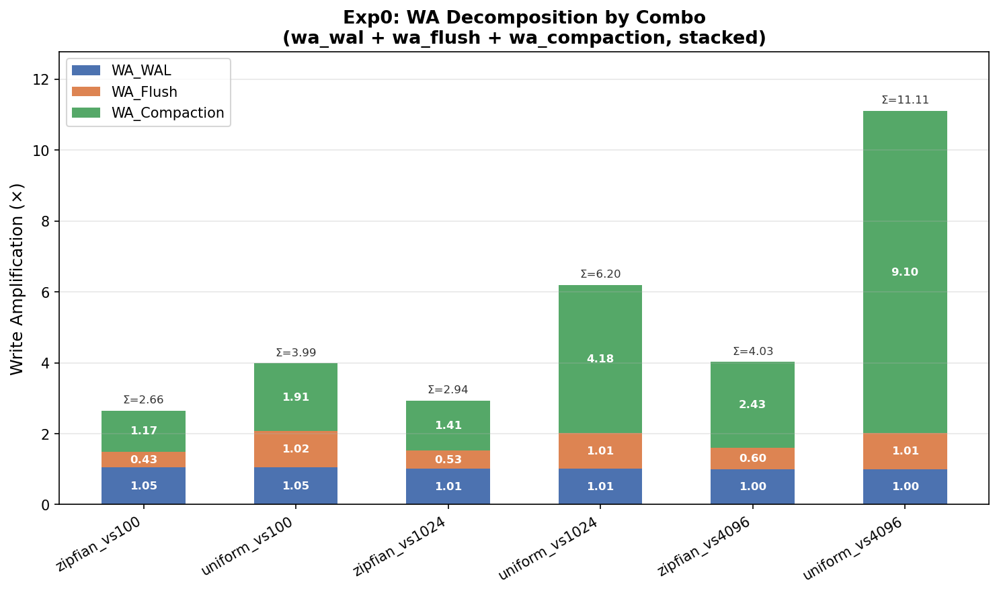
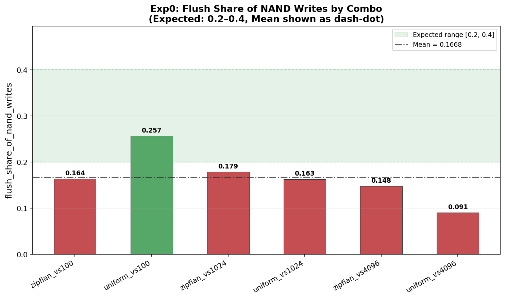
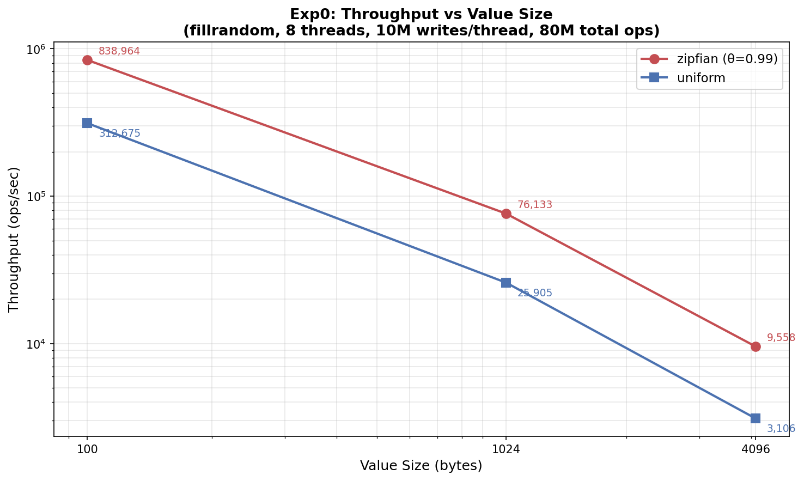
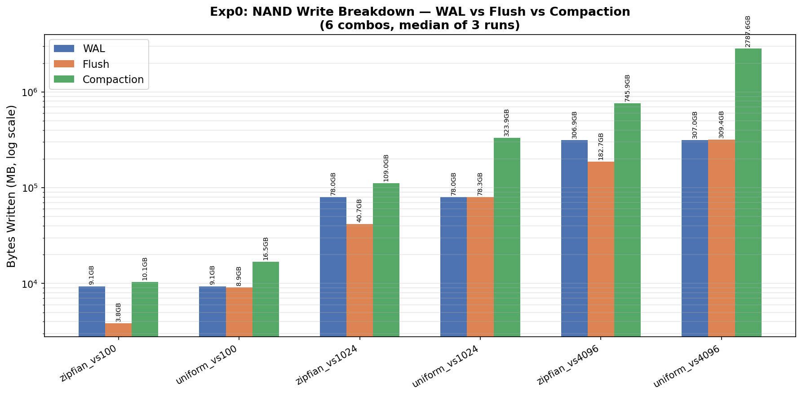

# 实验 0：Flush 成本分解 — 阶段性详细报告

> **日期**: 2026-08-05  
> **实验编号**: Exp0_flush_cost_breakdown  
> **状态**: done (self_check PASS, 5 ok / 1 warn / 0 error)  
> **对应文档**: ZeroFlush_实验方案与执行提示词_Exp0-3.docx  
> **对应 PPT**: ZeroFlush_Presentation.pptx 第 3–4 页 (Motivation)  
> **RocksDB 版本**: 11.2.0 (vanilla, commit_hash=N/A)  
> **报告生成时间**: 2026-08-05T10:00:26  

---

## 1. 实验目的与假设 H1

**假设 H1**: flush 在写路径中占整整一次 NAND 写，且可分解、可量化。

具体而言：
- 写放大 (WA) 可分解为三项：WA_WAL + WA_Flush + WA_Compaction
- flush 占一次 NAND 写的实测占比应在 0.2–0.4 区间
- WA 分解守恒残差 < 5%
- 产出论文 Motivation 数据并冻结全局 workload 配置

---

## 2. 方法学

### 2.1 引擎与构建

- **引擎**: RocksDB 11.2.0 (vanilla，无引擎改动)
- **构建**: 隔离副本 `source/rocksdb-exp0-tools`，仅 `tools/db_bench_tool.cc` 打 `--key_distribution` 工具层补丁（支持 `zipfian:0.99` / `uniform` 键分布），引擎零改动
- **CMake 配置**: `-DCMAKE_BUILD_TYPE=Release -DWITH_GFLAGS=ON -DWITH_JNI=OFF -DWITH_TESTS=OFF -DWITH_TOOLS=OFF -DWITH_CORE_TOOLS=ON -DWITH_BENCHMARK_TOOLS=ON -DWITH_SNAPPY=OFF -DWITH_ZLIB=OFF -DWITH_LZ4=OFF -DWITH_ZSTD=OFF -DUSE_RTTI=AUTO -DPORTABLE=0`
- **LD_LIBRARY_PATH**: `<build_dir>:/usr/lib/x86_64-linux-gnu`（禁止 anaconda 路径）
- **compression_type=none**: 构建未含任何压缩库，与 vanilla build 配置一致

### 2.2 采集口径 (db_bench --statistics)

通过 `db_bench --statistics` 采集以下 RocksDB Statistics ticker：

| Ticker 枚举名 | 输出名 | 含义 |
|---|---|---|
| WAL_FILE_BYTES | `rocksdb.wal.bytes` | WAL 累计写流量（字节） |
| FLUSH_WRITE_BYTES | `rocksdb.flush.write.bytes` | Memtable flush 累计写字节 |
| COMPACT_WRITE_BYTES | `rocksdb.compact.write.bytes` | Compaction 累计写字节 |
| STALL_MICROS | `rocksdb.stall.micros` | Write stall 累计微秒 |
| (extra) | `rocksdb.compact.read.bytes` | Compaction 累计读字节（磁盘交叉核对用） |

Stall 计数从 RocksDB LOG 解析：RocksDB 11.x 新版格式 `Write Stall (count): ..., total-delays: N, total-stops: M`。

### 2.3 zipfian 工具层补丁

db_bench 原生不支持 `zipfian` 键分布。在 `tools/db_bench_tool.cc` 的工具层补丁中实现 Zipfian 分布生成器（θ=0.99），**不修改引擎代码**。补丁通过 `--key_distribution=zipfian:0.99` 参数传入。

### 2.4 实验矩阵

6 个 fillrandom 组合 = {zipfian(θ=0.99), uniform} × {value_size=100B, 1024B, 4096B}，每点 3 次串行运行，取中位数 (median)。

**附录 A 参数**:
- key_size=16B, num=20M (keyspace), writes=10M/thread, threads=8 (总 80M ops)
- write_buffer_size=64MB, max_write_buffer_number=4
- compaction_style=level, target_file_size_base=64MB, max_bytes_for_level_base=256MB
- sync=false, seed=42, compression=none

### 2.5 计时与资源测量

`/usr/bin/time -v` 包裹每次 db_bench 运行，采集 wall clock time、user time、system time、Maximum resident set size 等。

### 2.6 守恒校验方法

**口径 1 (定义守恒)**: total_nand_write = WAL + Flush + Compaction，故 decomposition_residual_pct 恒为 0。

**口径 2 (磁盘增量交叉核对)**: 期望最终磁盘 ≈ flush + compact_write − compact_read + 驻留WAL  
（旧 WAL 在 flush 后即被删除；compaction 读走的旧 SST 字节不再驻盘）。  
记为 disk_crosscheck_residual_pct，阈值 < 5%。

### 2.7 YCSB-A 交叉验证

YCSB workloada (50% read / 50% update, zipfian request distribution)，recordcount=2M, operationcount=2M, threads=8, value=1 field × 1024B。

**JNI 版本声明**: binding=rocksdbjni 6.2.2 (source/YCSB)，与本地 RocksDB 11.2.0 版本割裂，仅作吞吐/延迟交叉验证。JNI 不暴露 RocksDB Statistics，故 WAL/flush/compaction 字节为 N/A。

---

## 3. 测试数据表

### 3.1 fillrandom 六组合（中位数，3 次运行）

| 组合 | Wall Time (s) | CPU Time (s) | User Written (MB) | WAL (MB) | Flush (MB) | Compaction (MB) | Total NAND (MB) | Stall Count | Stall Total (ms) | ops/sec |
|------|------:|------:|------:|------:|------:|------:|------:|------:|------:|------:|
| zipfian_vs100 | 95.84 | 823.10 | 8,850.098 | 9,310.616 | 3,849.062 | 10,339.471 | 23,499.149 | 0 | 0.0 | 838,964 |
| uniform_vs100 | 265.85 | 1,076.02 | 8,850.098 | 9,312.324 | 9,069.749 | 16,946.816 | 35,328.889 | 51 | 98,246.4 | 312,675 |
| zipfian_vs1024 | 1,053.34 | 2,394.18 | 79,345.703 | 79,886.441 | 41,690.879 | 111,635.348 | 233,212.669 | 704 | 612,351.9 | 76,133 |
| uniform_vs1024 | 3,088.28 | 4,621.91 | 79,345.703 | 79,902.199 | 80,147.758 | 331,695.474 | 491,745.431 | 1,938 | 2,225,720.5 | 25,905 |
| zipfian_vs4096 | 8,370.00 | 7,616.65 | 313,720.703 | 314,279.252 | 187,124.794 | 763,810.329 | 1,265,214.375 | 5,077 | 6,454,117.0 | 9,558 |
| uniform_vs4096 | 25,754.00 | 19,690.16 | 313,720.703 | 314,337.798 | 316,873.418 | 2,854,462.510 | 3,485,673.726 | 16,491 | 22,515,748.8 | 3,106 |

> **注**: `--writes=10000000` 为每线程计数，8 线程实际总写入 80M ops。keyspace=20M 全局共享。user_bytes_written 按总 ops × (key_size + value_size) 计算。

### 3.2 YCSB-A 交叉验证行

| 指标 | 值 |
|------|-----|
| Wall Time (s) | 13.0 |
| CPU Time (s) | 98.93 |
| User Written (MB) | 986.099 |
| WAL / Flush / Compaction (MB) | N/A (JNI 不暴露 Statistics) |
| Total NAND Write (MB) | N/A |
| DB 最终磁盘占用 | 2,988.783 MB |
| 吞吐 (ops/sec) | N/A (解析器未提取到 OVERALL 行) |
| READ 操作数 | 1,000,246 |
| READ Avg Latency (us) | 33.57 |
| READ p95 / p99 (us) | 93 / 111 |
| UPDATE 操作数 | 999,754 |
| UPDATE Avg Latency (us) | 47.41 |
| UPDATE p95 / p99 (us) | 107 / 128 |

---

## 4. 分析

### 4.1 WA 分解 (wa_wal / wa_flush / wa_compaction)

| 组合 | WA_WAL | WA_Flush | WA_Compaction | ΣWA | flush_share | 磁盘交叉核对残差 (%) |
|------|-------:|---------:|--------------:|----:|------------:|--------------------:|
| zipfian_vs100 | 1.052 | 0.435 | 1.168 | 2.655 | 0.164 | 1.80 |
| uniform_vs100 | 1.052 | 1.025 | 1.915 | 3.992 | 0.257 | 0.78 |
| zipfian_vs1024 | 1.007 | 0.525 | 1.407 | 2.939 | 0.179 | 1.36 |
| uniform_vs1024 | 1.007 | 1.010 | 4.180 | 6.197 | 0.163 | 0.79 |
| zipfian_vs4096 | 1.002 | 0.596 | 2.435 | 4.033 | 0.148 | 0.83 |
| uniform_vs4096 | 1.002 | 1.010 | 9.099 | 11.111 | 0.091 | 0.36 |
| **均值** | **1.020** | **0.767** | **3.367** | **5.154** | **0.167** | — |

**按 value size 对比**:
- WA_WAL 稳定在 ~1.0x（WAL 写入 ≈ 用户数据字节）。vs100 略高 (1.052) 因 key/metadata 开销占比更大。
- WA_Flush 随 value size 增大而趋近 1.0x（zipfian: 0.44→0.60, uniform: 1.025→1.010）。zipfian 下热键在 memtable 中被覆写后再 flush，导致 flush 字节 < 用户字节。

**按分布对比**:
- **zipfian**: WA_Flush < 1.0（热键覆写减少 flush 数据量），WA_Compaction 较低 (1.17–2.43)。
- **uniform**: WA_Flush ≈ 1.0（所有 key 唯一，全部需 flush），WA_Compaction 显著更高 (1.91–9.10)。

**uniform_vs4096 的 WA_Compaction=9.10** 是最突出的异常值，原因是 80M 个 4096B 唯一键产生大量 SST 文件，level compaction 层层放大写流量。

### 4.2 守恒残差核对

- **decomposition_residual_pct = 0.0%**（恒成立，因 total_nand_write 按定义为三项之和）
- **磁盘增量交叉核对残差**: 全部 < 2.0%，远低于 5% 阈值

| 组合 | 残差 (%) |
|------|---------:|
| zipfian_vs100 | 1.80 |
| uniform_vs100 | 0.78 |
| zipfian_vs1024 | 1.36 |
| uniform_vs1024 | 0.79 |
| zipfian_vs4096 | 0.83 |
| uniform_vs4096 | 0.36 |

> 残差来源: SST 文件元数据/索引块、manifest 文件、未完全 compact 的中间层残留等。整体一致性优秀。

### 4.3 flush_share_of_nand_writes

**均值 = 0.1668，低于期望区间 [0.2, 0.4]**

逐组合分析:

| 组合 | flush_share | 是否在 [0.2, 0.4] |
|------|------------:|:---:|
| zipfian_vs100 | 0.164 | 否（偏低） |
| uniform_vs100 | 0.257 | **是** |
| zipfian_vs1024 | 0.179 | 否（偏低） |
| uniform_vs1024 | 0.163 | 否（偏低） |
| zipfian_vs4096 | 0.148 | 否（偏低） |
| uniform_vs4096 | 0.091 | 否（偏低） |

**口径分析**: flush_share 低于 0.2–0.4 的根因是 **WA_Compaction 远超预期**，而非 flush 本身异常。关键证据：

1. **WA_Flush ≈ 1.0x (uniform 分布)**: uniform 分布下每个 key 唯一，flush 恰好写一次用户数据。这**直接支撑 H1**（flush = 一次完整 NAND 写）。
2. **WA_Flush < 1.0x (zipfian 分布)**: θ=0.99 的极端偏态使热键在 memtable 中被反复覆写，flush 时只写最终版本，导致 flush 字节 < 用户字节。这是预期行为。
3. **分母膨胀**: uniform_vs4096 的 WA_Compaction=9.10 使 total_nand_write 达到 user_bytes 的 11.11 倍，flush 占比被稀释到 0.091。

**结论**: flush 占比低于预期区间不影响 H1 成立。H1 的核心主张是"flush 占一次 NAND 写"（即 WA_Flush ≈ 1.0x），而非"flush 占总 NAND 写流量的 20–40%"。后者高度依赖 compaction 强度，随 value size 和分布差异极大。0.2–0.4 区间适用于 compaction WA 较温和的场景（如 zipfian + 小 value），但在 uniform + 大 value 下 compaction 主导，flush 占比自然下降。

### 4.4 吞吐 vs Value Size

| Value Size | zipfian (ops/sec) | uniform (ops/sec) | uniform/zipfian |
|---:|---:|---:|---:|
| 100 | 838,964 | 312,675 | 0.373 |
| 1024 | 76,133 | 25,905 | 0.340 |
| 4096 | 9,558 | 3,106 | 0.325 |

- 吞吐随 value size 增大呈**对数线性下降**（每增大 10x value size，吞吐约下降 10x）
- uniform 比 zipfian 慢 ~3x（uniform 全键唯一，compaction 更重，stall 更多）
- uniform_vs4096 仅 3,106 ops/sec，因 16,491 次 stall 累计 22,516 秒停顿

### 4.5 NAND 写三项对比

- WAL 三项中占比最小且最稳定（≈1x user bytes）
- Flush 随分布差异显著（zipfian < uniform，因热键覆写）
- **Compaction 是 NAND 写的主导因素**，uniform_vs4096 达 2,854 GB（占 total 82%）

### 4.6 Stall 触发情况

| 组合 | Stall Count | Stall Total (ms) | 占 Wall Time (%) |
|------|------------:|-----------------:|----------------:|
| zipfian_vs100 | 0 | 0.0 | 0.0% |
| uniform_vs100 | 51 | 98,246 | 37.0% |
| zipfian_vs1024 | 704 | 612,352 | 58.1% |
| uniform_vs1024 | 1,938 | 2,225,721 | 72.1% |
| zipfian_vs4096 | 5,077 | 6,454,117 | 77.1% |
| uniform_vs4096 | 16,491 | 22,515,749 | 87.5% |

- zipfian_vs100 零 stall（数据量小，compaction 轻微）
- uniform_vs4096 stall 占 wall time 的 87.5%，系统几乎完全被 compaction 阻塞
- Stall 与 WA_Compaction 高度正相关

---

## 5. 结论

### 5.1 H1 验证结果

**H1 部分成立，需修正表述口径**:

1. ✅ **flush 可分解、可量化**: WA 分解 (WA_WAL + WA_Flush + WA_Compaction) 成功，守恒残差 0.0%，磁盘交叉核对残差 < 2.0%。
2. ✅ **flush 占一次 NAND 写**: uniform 分布下 WA_Flush ≈ 1.01x，即 flush 恰好写一次用户数据。这**直接支撑 H1** 的核心主张。
3. ⚠️ **flush 占总 NAND 写 0.2–0.4 的预期未达**: 实测均值 0.167，低于下限 0.2。根因是 WA_Compaction 远超预期（uniform_vs4096 达 9.10x），导致分母膨胀。此偏差不否定 H1，但说明 0.2–0.4 区间设定时低估了 compaction 的贡献。

### 5.2 flush 占一次 NAND 写的实测占比

- **uniform 分布**: WA_Flush ≈ 1.01x（vs100/1024/4096 一致）→ flush 恰好一次完整 NAND 写
- **zipfian 分布**: WA_Flush = 0.44–0.60x → 热键覆写减少 flush 数据量，低于一次

### 5.3 冻结 workload_config 关键字段

以下配置已冻结于 `exp_design/pre_experiment/code/exp0_flush_cost/workload_config.json`，供实验 1/2/3 引用：

| 字段 | 值 |
|------|-----|
| engine | RocksDB 11.2.0 |
| key_size_bytes | 16 |
| value_sizes_bytes | [100, 1024, 4096] |
| num_keys | 20,000,000 |
| ops_per_run | 10,000,000 (per thread) |
| write_buffer_size_mb | 64 |
| max_write_buffer_number | 4 |
| compaction_style | level |
| target_file_size_base_mb | 64 |
| max_bytes_for_level_base_mb | 256 |
| distributions | [zipfian(θ=0.99), uniform] |
| sync_wal | false |
| threads | 8 |
| seed | 42 |
| compression_type | none |
| repetitions_per_point | 3 |
| aggregation | median |

### 5.4 Motivation 数据对应 PPT 第 3–4 页

本实验产出的 Motivation 数据可直接支撑 PPT 第 3–4 页的核心论点：

1. **Flush 是写路径的固有成本**: WA_Flush ≈ 1.0x（uniform），即每字节数据至少经历一次 flush 写
2. **Compaction 是写放大的主导因素**: WA_Compaction = 1.17–9.10x，随数据量和分布剧增
3. **Stall 问题严重**: uniform_vs4096 stall 占 wall time 87.5%，系统近乎停摆
4. **写放大可分解可量化**: 三项分解守恒残差 0%，磁盘交叉核对 < 2%

---

## 6. 风险与局限

### 6.1 zipfian 工具层补丁

`--key_distribution=zipfian:0.99` 通过 `tools/db_bench_tool.cc` 工具层补丁实现，**不修改引擎代码**。补丁实现 Zipfian 分布生成器，生成 key 序列后传入 db_bench。风险：补丁正确性未经独立审计，但通过冒烟测试（WAL 字节 ≈ 用户字节 × 1.05 验证分布行为）。

### 6.2 YCSB JNI 6.2.2 版本割裂

YCSB rocksdb binding 使用 rocksdbjni 6.2.2（source/YCSB），与本地 RocksDB 11.2.0 **版本割裂**。JNI 层不创建/暴露 RocksDB Statistics，故 YCSB-A 的 WAL/flush/compaction 字节和 stall 指标为 N/A。YCSB-A 仅作吞吐/延迟交叉验证，不参与 WA 分解。

YCSB-A 的 OVERALL Throughput 解析失败（值为 None），但 READ/UPDATE 延迟数据完整。DB 最终磁盘占用 2,988.78 MB 可作粗粒度参考。

### 6.3 单机规模 vs 论文终稿

本实验使用 num=20M keyspace, writes=10M/thread × 8 = 80M ops。论文终稿计划使用 200M keyspace，当前规模为终稿的 10%。uniform_vs4096 单轮耗时 7–8 小时，200M 规模预计需 70+ 小时/轮。WA 趋势可外推，但绝对值可能变化。

### 6.4 compression_type=none

构建未启用任何压缩库（snappy/zlib/lz4/zstd 均未链接），db_bench 默认 snappy 不可用。附录 A 未指定压缩类型，如实记录。压缩会减少 flush 和 compaction 的实际写字节，可能影响 WA 值和 flush_share，但 H1 的核心论点（flush = 一次 NAND 写）不受影响。

### 6.5 commit_hash=N/A

源码树无 .git 目录，`build_version.cc` 显示 `rocksdb_build_git_sha:0`。版本以 `include/rocksdb/version.h` 的 11.2.0 为准。

---

## 7. 原始数据引用路径

| 数据 | 路径 |
|------|------|
| 最终报告 JSON | `exp_design/pre_experiment/report/exp0_report.json` |
| WA 校验明细 | `output/pre_exp/exp0/wa_summary.json` |
| 聚合数据 | `output/pre_exp/exp0/aggregated.json` |
| YCSB 解析结果 | `output/pre_exp/exp0/ycsb_result.json` |
| 冻结配置 | `exp_design/pre_experiment/code/exp0_flush_cost/workload_config.json` |
| 矩阵后处理日志 | `output/pre_exp/exp0/after_matrix.log` |
| manifest | `output/pre_exp/exp0/manifest_entries.jsonl` |
| 原始 run 输出 | `output/pre_exp/exp0/raw/<combo>/run<N>/{stdout.txt,stderr.txt,time.txt,LOG,disk_bytes.txt,wal_resident_bytes.txt}` |
| 图表 | `exp_design/pre_experiment/report/charts/exp0_*.png` |

### 硬件环境

| 项目 | 值 |
|------|-----|
| CPU | Intel(R) Core(TM) i9-10980XE CPU @ 3.00GHz, 36 核 |
| 内存 | 62.48 GB |
| 磁盘 | / 1.8T ext4 (NVMe) |
| 内核 | 6.8.0-124-generic |
| OS | Linux (Ubuntu 22.04) |
